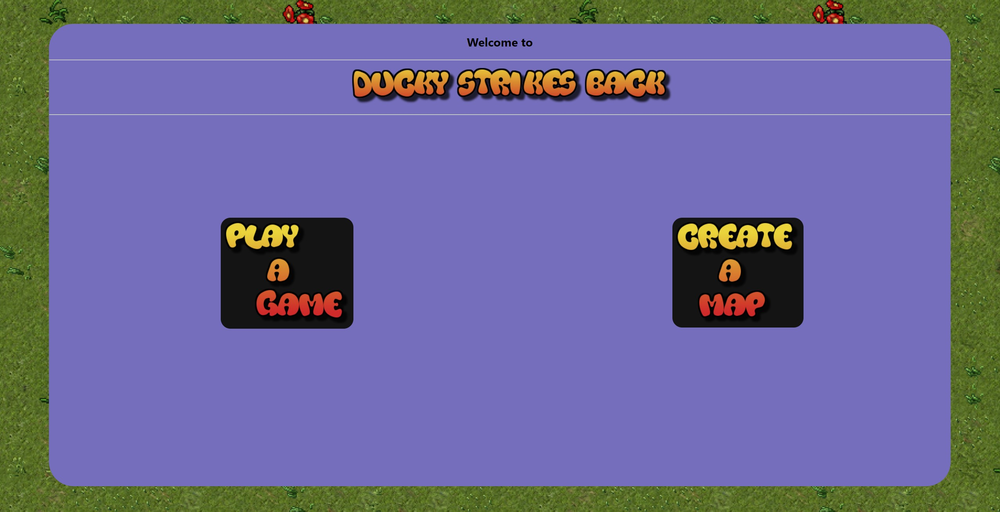
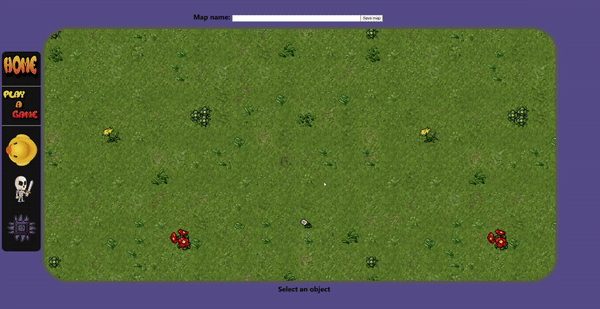
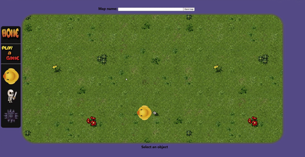
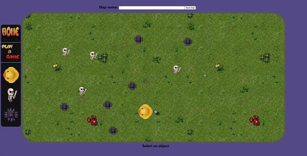

# Ducky's revenge
## Gh pages host <https://grilo16.github.io/DuckysRevengeGitHost/>

## This is a game project done over 4 days using React. 

### In the homescreen the user is presented with options to either :
 __play a game__ or __create a map__. 

# Play a game

## The game screen is presented and ready to play

### The user can move the duck by using the arrow keys and they can shoot by pressing space bar. Lastly the user can access the game menu by pressing escape.  

##### Gameplay involves aiming and shooting at the skeleton enemies, sharp blocks are indestructible and ducky cannot walk over them, and they are able to stop ducky's projectile.

# Create a map

## Here the user can create custom maps to play that can be saved and played at any point.

### To create a map the user must add at least one duck, name and save the map.  

### The user may add as many enemies and obstacles as they wish before saving the game. 

### Also the user is able to ctrl+scroll + up or down to zoom in or out allowing the user to place map elements in a much larger area.

## Dont forget to name and save your map at the top of the page before playing a game =)